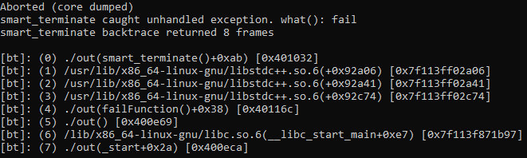

# smart-terminate
Print stack trace when terminate is throwing. 
**Work only on Unix machine due to execinfo.h (backtrace function)**

## Project integration
Simple, just put the `smart_terminate.h` file in your project.

## Compilation
Please compile with `-rdynamic` flag.

`
  make && make run
`

`make run` pipes the error output in `c++filt` to have a better printing.

## Output

